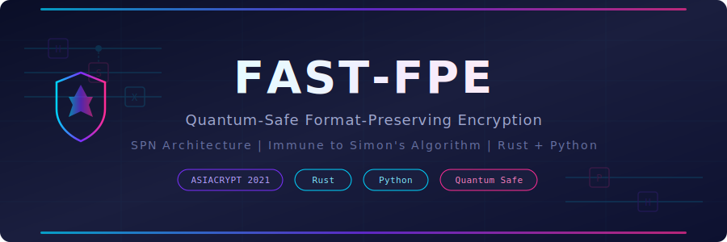

<p align="center">
  
</p>

<p align="center">
  <strong>The first production-grade quantum-safe format-preserving encryption library</strong><br/>
  Built in Rust. Bindings for Python. Based on the ASIACRYPT 2021 FAST algorithm.
</p>

<p align="center">
  <a href="#quick-start"></a>
  <a href="fast-fpe/docs/whitepaper.md"></a>
  <a href="#quantum-resistance-verified"></a>
</p>

<p align="center">
  
  
  
  
  
  
</p>

---

## Why This Exists

Every major tokenization system in production today — every payment processor, every healthcare data vault, every telecom subscriber database — relies on **FF1 or FF3-1** for format-preserving encryption. Both are Feistel networks. Both are **structurally broken by quantum computers**.

Simon's algorithm doesn't just speed up brute force. It exploits the fundamental architecture of Feistel ciphers — the fact that one half of the block passes through unchanged each round — to achieve an **exponential** speedup. More rounds don't help. Longer keys don't help. The vulnerability is structural.

**FAST** replaces the Feistel network with an SPN (Substitution-Permutation Network) that transforms the **entire block every round**. No untouched half. No structural period for Simon's algorithm to find. No quantum foothold.

> **Read the full analysis:** [The Quantum FPE Crisis — Whitepaper](fast-fpe/docs/whitepaper.md)

---

## Quick Start

### Rust

```rust
use fast_core::{FastCipher, FastKey, Domain, SecurityLevel};

let key = FastKey::new(&[0x42u8; 16])?;
let cipher = FastCipher::new(&key, Domain::Decimal, SecurityLevel::Quantum128)?;

// Encrypt: "123456789" → 9 random-looking digits
let token = cipher.encrypt(b"tweak", "123456789")?;
assert_eq!(token.len(), 9);
assert!(token.chars().all(|c| c.is_ascii_digit()));

// Decrypt: recover the original
let plain = cipher.decrypt(b"tweak", &token)?;
assert_eq!(plain, "123456789");
```

### Python

```python
from fast_fpe import FastCipher

cipher = FastCipher(key=b'\x42' * 16, radix=10, security="quantum-128")

token = cipher.encrypt(tweak=b"tweak", plaintext="123456789")
plain = cipher.decrypt(tweak=b"tweak", ciphertext=token)
assert plain == "123456789"
```

---

## Real-World Tokenization Examples

### Credit Card PAN (BIN-preserving)

```rust
let cipher = FastCipher::new(&key, Domain::Decimal, SecurityLevel::Quantum128)?;

let pan = "4111111111111111";
let bin = &pan[..6];          // "411111" — preserved
let middle = &pan[6..12];     // encrypted with BIN as tweak
let last4 = &pan[12..];       // "1111" — preserved

let tokenized_middle = cipher.encrypt(bin.as_bytes(), middle)?;
let token = format!("{bin}{tokenized_middle}{last4}");
// → "411111XXXXXX1111" — valid 16-digit PAN format
```

### Social Security Number

```python
cipher = FastCipher(key=key, radix=10, security="quantum-128")
token = cipher.encrypt(tweak=b"ssn-scope", plaintext="123456789")
# → "847920134" — 9 digits, same format
```

### Batch Processing (Zero AES on Hot Path)

```rust
// Pre-compute state ONCE (amortized setup)
let state = FastCipherState::setup(&key, b"tweak", 10, 9, SecurityLevel::Quantum128)?;
let mapping = Domain::Decimal.mapping();

// Encrypt millions — each call is pure table lookups, no AES
for ssn in &million_ssns {
    let token = FastCipher::encrypt_with_state(&state, ssn, mapping.as_ref())?;
}
```

---

## FAST vs FF1 vs FF3-1

| | **FAST** | FF1 | FF3-1 |
|---|:---:|:---:|:---:|
| **Architecture** | SPN | Feistel (10 rounds) | Feistel (8 rounds) |
| **Quantum safe** | **Yes** | No (Simon's) | No (Simon's + classical) |
| **NIST status** | Academic (ASIACRYPT 2021) | SP 800-38G | **Withdrawn** (2025) |
| **Hot-path AES calls** | **0** (table lookup) | 10+ per encrypt | 8+ per encrypt |
| **Batch performance** | **Amortized O(1) setup** | Linear | Linear |
| **Constant-time** | **Yes** (linear scan) | Implementation-dependent | Implementation-dependent |
| **Memory safety** | `#![forbid(unsafe_code)]` | Varies | Varies |
| **Published** | 2021 | 2016 | 2016 |

---

## Quantum Resistance — Verified

We don't just claim quantum safety — we **test it**. Our TensorFlow/Keras neural cryptanalysis suite runs 7 independent verifications:

| Test | What It Proves | Result |
|------|---------------|--------|
| Neural SPRP Distinguisher (radix 10) | Indistinguishable from random permutation | **0.49 accuracy (random = 0.50)** |
| Neural SPRP Distinguisher (radix 36) | Same property, larger alphabet | **0.47 accuracy** |
| Simon's Structural Immunity | No hidden period exists, full bijection on 10K values | **Confirmed** |
| Strict Avalanche Criterion | Single digit change affects all positions | **0.90 mean rate** |
| Differential Uniformity | Output diffs match random permutation diffs | **0.49 accuracy** |
| Known-Plaintext Attack | Neural network learns nothing from PT/CT pairs | **MSE > random** |
| SPN Structure Verification | No Feistel half-block preservation | **0.00 correlation** |

> **All 7/7 tests pass.** Run them yourself: `python python/tests/test_quantum_resistance.py`

---

## Architecture

```
Quantam-Library/
└── fast-fpe/                    # Open-source FPE library (MIT/Apache-2.0)
    ├── crates/
    │   ├── fast-core/           # Core FAST algorithm — SPN, S-box, key schedule
    │   ├── fast-ff1/            # FF1 implementation (for comparison & migration)
    │   ├── fast-migrate/        # FF1 → FAST batch migration utility
    │   └── fast-python/         # Python bindings via PyO3/maturin
    ├── vectors/                 # Test vectors (JSON)
    └── docs/
        └── whitepaper.md        # "The Quantum FPE Crisis" (~4,500 words)
```

### How FAST Works (One Round)

```
Input: x = [x₀, x₁, x₂, ..., x_{ℓ-1}]    (each xᵢ ∈ ℤₐ)

   P1  │ x₀ ← (x₀ + x_{ℓ-1}) mod a        ← Addition (key mixing)
   P2  │ x₀ ← σ[seq[r]](x₀)               ← S-box substitution (non-linearity)
   P1' │ x₀ ← (x₀ - x_w) mod a            ← Subtraction (cross-position diffusion)
   P3  │ x ← rotate_left(x, 1)             ← Circular shift (position rotation)

After ℓ rounds, every position has been the active position exactly once.
Unlike Feistel: EVERY position is transformed. No pass-through half.
```

---

## Supported Domains

| Domain | Radix | Characters | Use Case |
|--------|-------|-----------|----------|
| `Decimal` | 10 | `0-9` | PANs, SSNs, phone numbers |
| `LowerAlpha` | 26 | `a-z` | Names, identifiers |
| `Alphanumeric` | 36 | `0-9, a-z` | License plates, codes |
| `AlphanumericCase` | 62 | `0-9, a-z, A-Z` | Tokens, mixed-case IDs |
| `Custom { radix }` | 4-65536 | Configurable | Any alphabet |

---

## FF1 → FAST Migration

Already using FF1? Migrate without downtime:

```rust
use fast_migrate::Ff1ToFastMigrator;

let migrator = Ff1ToFastMigrator::new(
    &ff1_key, &fast_key, 10, SecurityLevel::Quantum128,
)?;

// Batch migrate with progress tracking
let results = migrator.migrate_batch(&tweak, &old_tokens, |done, total| {
    println!("Migrating: {done}/{total}");
})?;
```

> See the [whitepaper](fast-fpe/docs/whitepaper.md#7-migration-path-from-ff1-to-fast-without-downtime) for the recommended 4-phase migration strategy.

---

## Security

### Guarantees

- **SPRP security** under the assumption that AES is a secure PRF
- **Constant-time S-box lookups** via `subtle::ConditionallySelectable` linear scan
- **Zeroize on drop** for all key material (`zeroize::ZeroizeOnDrop`)
- **No unsafe code** — `#![forbid(unsafe_code)]` on all crates
- **Two security levels:**
  - `Classical128` — 2s rounds (standard)
  - `Quantum128` — 3s rounds (50% more for quantum margin)

### Warnings

> **FAST is NOT a NIST-standardized algorithm.** It is a peer-reviewed academic design published at ASIACRYPT 2021. It has not undergone third-party security audit. Consult your compliance team before production deployment.

> **PCI DSS note:** Organizations subject to PCI DSS should consult their QSA about using non-NIST FPE algorithms for cardholder data tokenization.

---

## Building

### Rust

```bash
# Run all tests
cd fast-fpe && cargo test --all

# Run benchmarks
cargo bench --package fast-core
```

### Python

```bash
# Install from source
cd fast-fpe/crates/fast-python
pip install maturin
maturin develop --release

# Run tests
pytest python/tests/

# Run quantum resistance verification (requires tensorflow)
pip install tensorflow numpy
python python/tests/test_quantum_resistance.py
```

---

## Citation

```bibtex
@inproceedings{fast2021,
  title     = {FAST: Secure and High Performance Format-Preserving Encryption
               and Tokenization},
  author    = {Durak, F. Bet{\"u}l and Horst, Henning and Horst, Michael
               and Vaudenay, Serge},
  booktitle = {ASIACRYPT 2021},
  year      = {2021},
  series    = {LNCS},
  volume    = {13093},
  publisher = {Springer}
}
```

---

## License

The `fast-fpe` library is dual-licensed under [MIT](fast-fpe/LICENSE-MIT) and [Apache 2.0](fast-fpe/LICENSE-APACHE).

---

<p align="center">
  <sub>Built with Rust and verified with TensorFlow/Keras neural cryptanalysis.</sub><br/>
  <sub>Protecting data today against the quantum computers of tomorrow.</sub>
</p>
