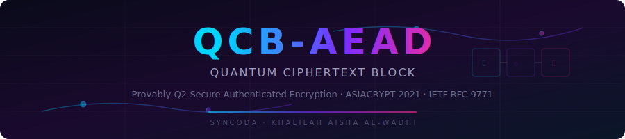

<p align="center">
  
</p>

<p align="center">
  
  
  
  
  
  
  
</p>

# qcb-aead

**QCB (Quantum Ciphertext Block)** — the only AEAD scheme with provable security against quantum superposition queries (Q2 model). Built with Rust and Python bindings by [Syncoda](https://github.com/khalilahalwadhi) / **Khalilah Aisha al-Wadhi**.

## Why QCB?

Classical AEAD modes (GCM, CCM, EAX, OCB, GCM-SIV) all rely on structures — polynomial hashing, Feistel networks, or Gray-code counters — that are broken in polynomial time by **Simon's quantum period-finding algorithm** when an adversary can issue superposition queries to the encryption oracle (the **Q2 model**).

QCB replaces these vulnerable structures with a **Tweakable Block Cipher (TBC)** via the XEX construction, achieving provable Q2 security as demonstrated in the ASIACRYPT 2021 paper by Bhaumik, Bonnetain, Chailloux, Leurent, Naya-Plasencia, Schrottenloher, and Seurin.

**IETF RFC 9771** cites QCB as the sole example of a Q2-model-secure AEAD scheme.

| Property | QCB | GCM | OCB | GCM-SIV |
|---|---|---|---|---|
| **Q2 Security** | **Proven** | Broken (Simon) | Broken (Simon) | Broken (Simon) |
| **Q1 Security** | Yes | Yes | Yes | Yes |
| **Classical Security** | Yes | Yes | Yes | Yes |
| **IETF RFC** | **9771** | 5116 | — | 8452 |
| **Rate** | 1 TBC/block | 1 AES + 1 GHASH | 1 AES/block | 2 passes |
| **Online** | Yes | Yes | Yes | No (2-pass) |
| **Architecture** | TBC (XEX) | Polynomial hash | Gray-code TBC | Polynomial hash |

## Security Model

The **Q2 model** assumes an adversary with:
- A quantum computer capable of running Simon's algorithm
- Quantum superposition access to the encryption oracle
- Classical access to the decryption oracle

This is the strongest standard model for symmetric AEAD security. QCB is the only scheme proven secure under Q2.

## Architecture

```
Plaintext:  M₁    M₂    M₃  ···  Mₘ
             │      │      │        │
             ▼      ▼      ▼        ▼
           ┌────┐ ┌────┐ ┌────┐  ┌────┐
           │Ẽ_K │ │Ẽ_K │ │Ẽ_K │  │Ẽ_K │  ← Tweak = (0x01, N, i)
           └────┘ └────┘ └────┘  └────┘
             │      │      │        │
             ▼      ▼      ▼        ▼
Ciphertext: C₁    C₂    C₃  ···  Cₘ

Checksum = M₁ ⊕ M₂ ⊕ M₃ ⊕ ··· ⊕ Mₘ
Tag = Ẽ_K(0x05, N, 0)(Checksum ⊕ AD_hash)
```

**Tweakable Block Cipher (XEX):**
```
Ẽ_K(T, X) = AES_K(X ⊕ Δ) ⊕ Δ    where Δ = AES_K(T)
```

**Domain separators** ensure tweak disjointness:
| Code | Domain | Usage |
|------|--------|-------|
| `0x01` | MessageFull | Full 16-byte plaintext blocks |
| `0x02` | MessagePartial | Final partial block (10* padded) |
| `0x03` | AdFull | Full 16-byte AD blocks |
| `0x04` | AdPartial | Final partial AD block (10* padded) |
| `0x05` | Tag | Tag generation |

## Quick Start

### Rust

```toml
[dependencies]
qcb-core = { path = "crates/qcb-core" }
```

```rust
use qcb_core::{Qcb, QcbKey};

let key = QcbKey::new(&[0x42; 32]).unwrap();
let cipher = Qcb::new(&key);
let nonce = [0u8; 12];

// Encrypt
let ciphertext = cipher.encrypt(&nonce, b"associated data", b"Hello, quantum-safe world!").unwrap();

// Decrypt
let plaintext = cipher.decrypt(&nonce, b"associated data", &ciphertext).unwrap();
assert_eq!(plaintext, b"Hello, quantum-safe world!");
```

### Python

```bash
cd crates/qcb-python
pip install maturin
maturin develop --release
```

```python
from qcb_aead import QcbCipher

cipher = QcbCipher(key=b"\x42" * 32)
ct = cipher.encrypt(nonce=b"\x00" * 12, data=b"Hello!", aad=b"metadata")
pt = cipher.decrypt(nonce=b"\x00" * 12, ciphertext=ct, aad=b"metadata")
```

## Key Sizes

| Key Length | Cipher | Security Level |
|-----------|--------|----------------|
| 16 bytes | AES-128 | 128-bit classical, 64-bit quantum |
| 32 bytes | AES-256 | 256-bit classical, 128-bit quantum |

## Parameters

| Parameter | Size | Notes |
|-----------|------|-------|
| Key | 16 or 32 bytes | AES-128 or AES-256 |
| Nonce | 12 bytes | Must be unique per encryption |
| Tag | 16 bytes | Appended to ciphertext |
| Max message | 2²⁴ − 1 blocks | ~268 MB |

## Project Structure

```
qcb-aead/
├── Cargo.toml                    # Workspace root
├── README.md                     # This file
├── crates/
│   ├── qcb-core/                 # Core Rust library
│   │   ├── Cargo.toml
│   │   └── src/
│   │       ├── lib.rs            # Public API
│   │       ├── qcb.rs            # AEAD encrypt/decrypt
│   │       ├── tbc.rs            # Tweakable Block Cipher (XEX)
│   │       ├── types.rs          # Key, tweak encoding, domain separators
│   │       └── error.rs          # Error types
│   └── qcb-python/               # Python bindings (PyO3 + Maturin)
│       ├── Cargo.toml
│       ├── pyproject.toml
│       ├── src/lib.rs
│       └── python/
│           ├── qcb_aead/__init__.py
│           └── tests/test_qcb.py
├── docs/
│   └── whitepaper.md             # Technical whitepaper
└── vectors/                      # Test vectors (JSON)
```

## Testing

```bash
# Run all Rust tests
cargo test --workspace

# Run Python tests
cd crates/qcb-python
maturin develop --release
pytest python/tests/ -v
```

## Security Properties

- **`#![forbid(unsafe_code)]`** — no unsafe Rust anywhere
- **`zeroize::ZeroizeOnDrop`** — key material is zeroed when dropped
- **`subtle::ConstantTimeEq`** — constant-time tag comparison prevents timing attacks
- **10\* padding** — standard bit-padding for partial blocks
- **Domain-separated tweaks** — prevents cross-domain forgery

## References

1. Bhaumik, Bonnetain, Chailloux, Leurent, Naya-Plasencia, Schrottenloher, Seurin. *"QCB: Efficient Quantum-secure Authenticated Encryption."* ASIACRYPT 2021. [IACR ePrint 2021/1000](https://eprint.iacr.org/2021/1000)
2. IETF RFC 9771. *"Selecting Symmetric Key Sizes for Quantum Computing Resistance."* Section on AEAD quantum security.
3. Simon, D. *"On the Power of Quantum Computation."* SIAM Journal on Computing, 1997.
4. Kaplan, Leurent, Leverrier, Naya-Plasencia. *"Breaking Symmetric Cryptosystems using Quantum Period Finding."* CRYPTO 2016.

## License

Dual-licensed under [MIT](LICENSE-MIT) or [Apache-2.0](LICENSE-APACHE) at your option.

---

<p align="center">
  <strong>Syncoda</strong> · Khalilah Aisha al-Wadhi<br/>
  <em>Building quantum-resistant cryptography for the post-quantum era</em>
</p>
